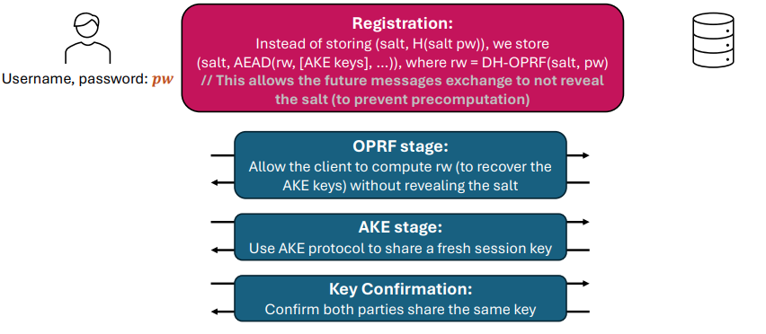

# OPQAUE Protocol

## Introduction

In this folder you find my implementation of the `OPQAUE` protocol. 

As presented in the lecture it consist of 4 stages:

- `Registration`
- `OPRF` stage for login
- `AKE` stage to share a symmetric key for communication
- `Key Confirmation` stage using HMAC similarity to check if both parties have the same key

## Usage

You need two terminals to start my implementation. One terminal acts as the `Server` and one as the `Client`

```sh
#terminal 1
> python Server.py #(in some cases change to task3/L9/Server.py)
```

```sh
#terminal 2
> python Client.py #(in some cases change to task3/L9/Client.py)
```

The server starts and waits for incoming connections. The client asks for your name and password.

```sh
#terminal 2
> Enter your username: <Your Name>
> Enter your password: <Your Password>
```

After you entered your credentials the OPQAUE protocol starts automatically the following steps are performed:

- The client sends a registration request containing the name and password.
- The server gets the registration request and computes `rw` as well as the `rw_key` and pairs of keys `lsks, lPKs` for the server and `lskc, lPKc` for the client. Then it saves information to a database. The saved client key info bundle is encrypted before storage. The server replies to the client that the registration was successful (or that the user is already registered).
- On getting the confirmation that the user is registred he starts a login request by computing $h(pw)^\alpha$ and sending the request

```python
#login request
{'type': 'login', 'username': <Your Name>, 'h(pw)_alpha': <h_pw_alpha>}
```

- The server computes $h(pw)^{\alpha\cdot s}$ and sends the value together with the encrypted client key info to the client

```python
#login server reaction
{'type': 'login_reaction', 'h(pw)_alpha_salt': <h_pw_alpha_salt>, 
'enc_client_key_info': {'iv': <iv>, 'cipher': <cipher>, 'tag': <tag>}}
```

- The client is now able to derive $h(pw)^s = (h(pw)^{\alpha\cdot s})^{\alpha^{-1}}$. Now `rw` as well as `rw_key` can be computed and the encrypted client key info decrypted
- The client saves the key bundle and proceeds to the AKE stage by sending an AKE start request to the server. It contains another public key component `ePKc` from a key pair `eskc, ePKc`.

```python
#AKE start
{'type': 'start_AKE', 'username': <Your Name>, 'ePKc': <ePKc>}

```

- The Server receives the message and sends the client the corresponding public key `ePKs` from the key pair `esks, ePKs`

```python
#AKE server reaction
{'type': 'AKE_reaction', 'ePKs': <ePKs>}
```

- Both parties can now compute the shared secret SK using different equations.
```python
#Clien equation
def HMQV_KClient(self,ePKs):
        d = int.from_bytes(hasher(self.ePKc.to_string()+b"Server").digest(),"big") % utils.n
        e = int.from_bytes(hasher(ePKs.to_string()+self.username.encode()).digest(),"big") % utils.n
        lPKs = VerifyingKey.from_string(bytes.fromhex(self.key_info['lPKs']),curve=CURVE)
        lskc = SigningKey.from_string(bytes.fromhex(self.key_info['lskc']),curve=CURVE)
        ss = (ePKs.pubkey.point + (lPKs.pubkey.point*e))*((self.eskc.privkey.secret_multiplier+d*lskc.privkey.secret_multiplier)% utils.n)
        print(f"ss: {ss.to_bytes()}")
        AEK_SK = hkdf_expand(ss.to_bytes(),b"")
        return AEK_SK

#Server equation
def HMQV_KServer(self, ePKc:VerifyingKey, username:str):
        d = int.from_bytes(hasher(ePKc.to_string()+b"Server").digest(),'big')% utils.n
        e = int.from_bytes(hasher(self.ePKs.to_string()+username.encode()).digest(),'big')% utils.n

        #reading the keybundle from the database 
        with open(self.database_path,"r") as db:
            for line in db:
                line = json.loads(line)
                if line['username'] == username:
                    lPKc = VerifyingKey.from_string(bytes.fromhex(line['server_key_info']['lPKc']),curve=CURVE)
                    lsks = SigningKey.from_string(bytes.fromhex(line['server_key_info']['lsks']),curve=CURVE)
                    lPKs = VerifyingKey.from_string(bytes.fromhex(line['server_key_info']['lPKs']),curve=CURVE)
        
        ss = (ePKc.pubkey.point + (lPKc.pubkey.point*d))*((self.esks.privkey.secret_multiplier+e*lsks.privkey.secret_multiplier)% utils.n)
        print(f"ss: {ss.to_bytes()}")
        AEK_SK = hkdf_expand(ss.to_bytes(),b"")
        return AEK_SK
```

- After both parties computed their symmetric secrets those keys need to be confirmed by checking mac similarity. Both parties compute a pair of keys $K_s, K_c$ by using the the SK as the key. Then those two new keys are used to compute the HMACs $mac_c, mac_s$.
- After computation the user sends his $mac_c$ to the server
- The server confirms the validity and sends his $mac_s$ to the Client
- The client does the same and if everything went correctly both sides end up with the same SK and an successful outcome of the key confirmation

```sh
#terminal 1 | Server
> Key confirmation successful for <Your Name>
```

```sh
#terminal 2 | Client
> Key confirmation successful!
```